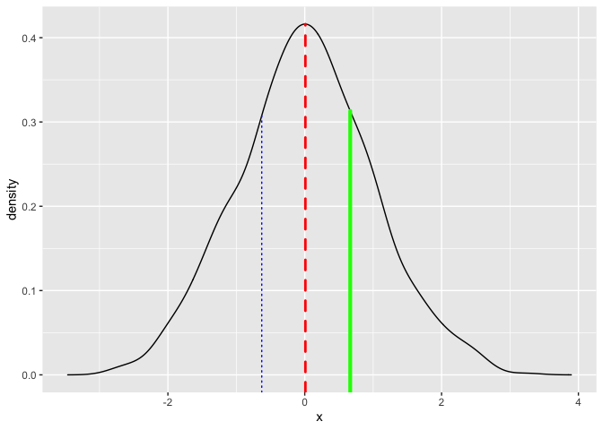
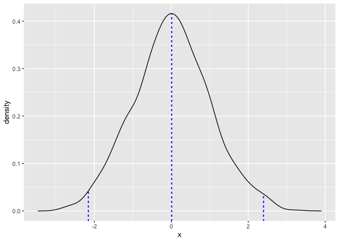

<!-- README.md is generated from README.Rmd. Please edit that file -->

# ggqdens

<!-- badges: start -->
<!-- badges: end -->

`ggqdens` provides a simple extension of `geom_density` that allows for
drawing vertical lines at specified quantiles.

## Installation

You can install the development version of `ggqdens` from
[GitHub](https://github.com/) with:

``` r
# install.packages("devtools")
devtools::install_github("joranE/ggqdens")
```

## Example

Here is a basic example:

``` r
library(ggqdens)
#> Loading required package: ggplot2
```

``` r
set.seed(123)
data <- data.frame(x = rnorm(1000))
```

``` r
# An ugly example
ggplot(data, aes(x = x)) +
  geom_density_quantile(
    quantiles = c(0.25, 0.5, 0.75),
    quantile_color = c("blue", "red", "green"),
    quantile_linewidth = c(0.5, 1, 1.5),
    quantile_linetype = c("dotted", "dashed", "solid")
  )
```



``` r
# A slightly less ugly example
ggplot(data, aes(x = x)) +
  geom_density_quantile(
    quantiles = c(0.01, 0.5, 0.99),
    quantile_color = "blue",
    quantile_linewidth = 0.8,
    quantile_linetype = "dotted"
  )
```


